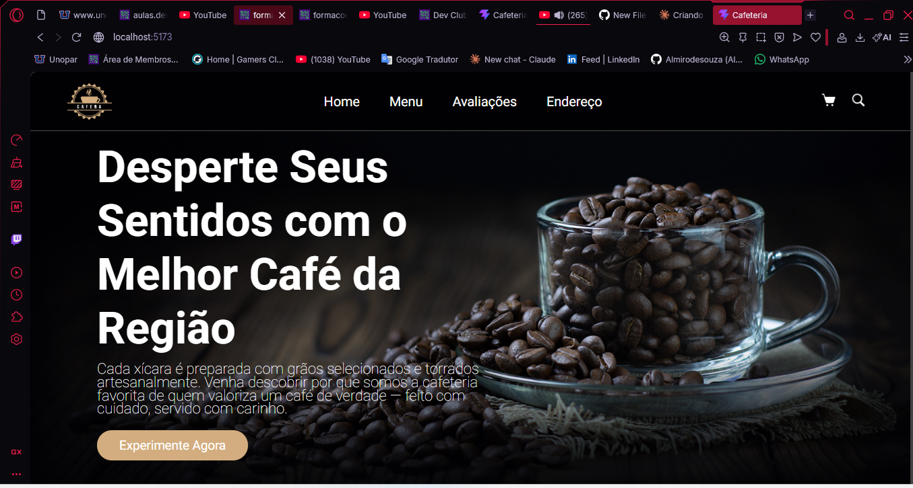
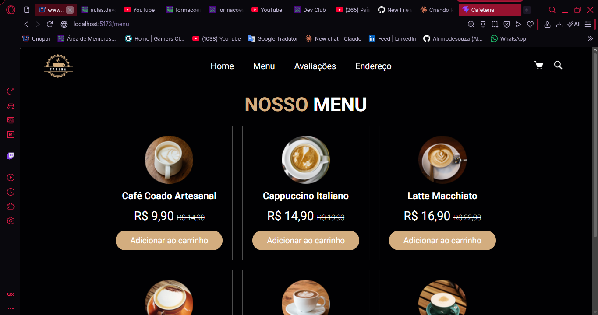
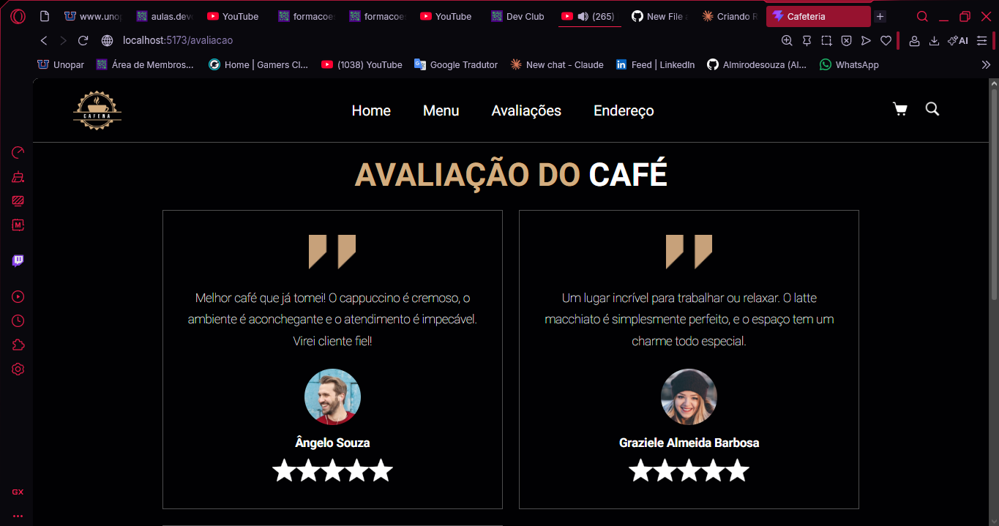

<h1 align="center">
  
  <br/>
  Cafena ☕ — Landing Page
</h1>

<p align="center">
  
  
  
  
  
</p>

<p align="center">
  Landing page fictícia de uma cafeteria artesanal, desenvolvida com React, React Router DOM e Styled Components. Projeto desenvolvido durante o curso Full Stack da <strong>DevClub</strong>.
</p>

---

## 📸 Preview

| Home | Menu | Avaliações |
|------|------|------------|
|  |  |  |

---

## ✨ Funcionalidades

- **Navbar** com navegação entre páginas via React Router DOM
- **Página Home** com hero section, slogan e chamada para ação
- **Página Menu** com listagem de produtos, preços promocionais e botão "Adicionar ao carrinho"
- **Página Avaliações** com depoimentos de clientes e sistema de estrelas
- **Página Endereço** com localização da cafeteria
- Ícones de carrinho e busca na navbar
- Identidade visual consistente com tema escuro e paleta dourada/caramelo

> ⚠️ **Observação:** o projeto foi desenvolvido para desktop e **ainda não possui responsividade mobile**. A adaptação para dispositivos móveis está prevista no roadmap.

---

## 🛠️ Tecnologias

| Tecnologia | Versão | Uso |
|---|---|---|
| [React](https://react.dev/) | 19 | Biblioteca principal de UI |
| [Vite](https://vitejs.dev/) | 8 | Bundler e servidor de desenvolvimento |
| [React Router DOM](https://reactrouter.com/) | 7 | Roteamento entre páginas |
| [Styled Components](https://styled-components.com/) | 6 | Estilização com CSS-in-JS |
| [PropTypes](https://www.npmjs.com/package/prop-types) | 15 | Tipagem de props dos componentes |

---

## 📁 Estrutura do Projeto

```
react-cafeteria/
├── public/
│   └── logo.png
├── src/
│   ├── assets/          # Imagens e recursos estáticos
│   ├── components/      # Componentes reutilizáveis (Navbar, etc.)
│   ├── pages/           # Páginas da aplicação
│   │   ├── Home/
│   │   ├── Menu/
│   │   ├── Avaliacao/
│   │   └── Endereco/
│   ├── styles/          # Estilos globais
│   ├── App.jsx
│   └── main.jsx
├── index.html
├── package.json
└── vite.config.js
```

---

## 🚀 Como Executar Localmente

### Pré-requisitos

- [Node.js](https://nodejs.org/) (versão 18 ou superior)
- [Git](https://git-scm.com/)

### Passo a passo

```bash
# 1. Clone o repositório
git clone https://github.com/Almirodesouza/react-cafeteria.git

# 2. Acesse a pasta do projeto
cd react-cafeteria

# 3. Instale as dependências
npm install

# 4. Inicie o servidor de desenvolvimento
npm run dev
```

Acesse **http://localhost:5173** no seu navegador.

### Scripts disponíveis

| Comando | Descrição |
|---|---|
| `npm run dev` | Inicia o servidor de desenvolvimento |
| `npm run build` | Gera a versão de produção |
| `npm run preview` | Pré-visualiza a build de produção |
| `npm run lint` | Executa o ESLint no código |

---

## 🗺️ Roadmap

- [ ] Responsividade mobile completa
- [ ] Funcionalidade real de carrinho de compras
- [ ] Animações e transições entre páginas
- [ ] Deploy na Vercel ou Netlify
- [ ] Integração com backend para gerenciar pedidos

---

## 👨‍💻 Autor

Feito com ☕ por **Almiro de Souza**

[](https://github.com/Almirodesouza)
[](https://www.linkedin.com/in/almirodesouza/)

